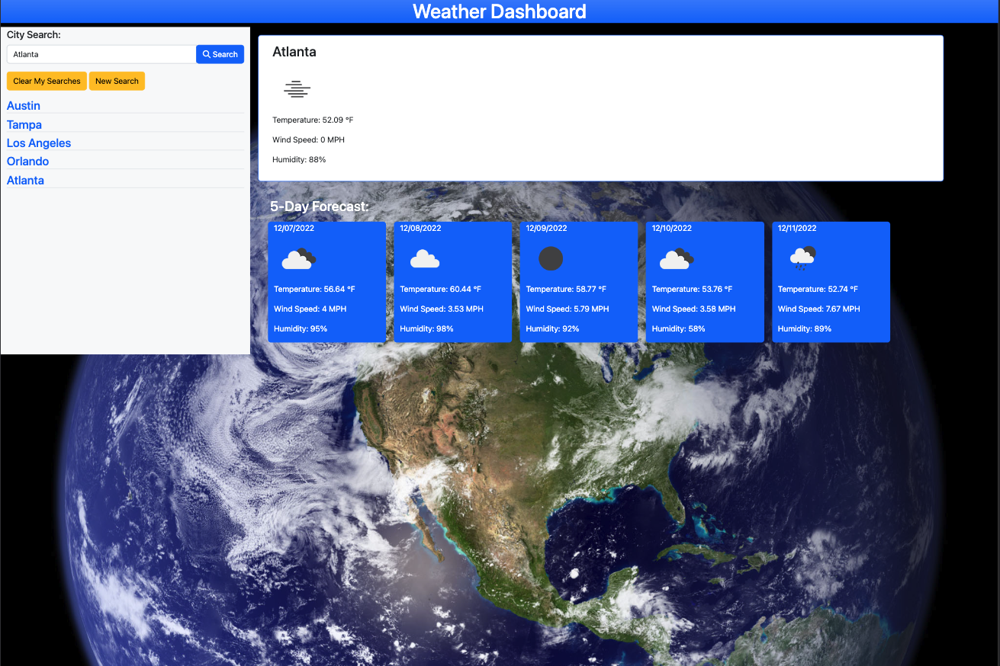
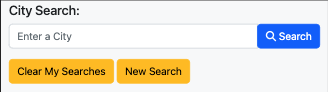
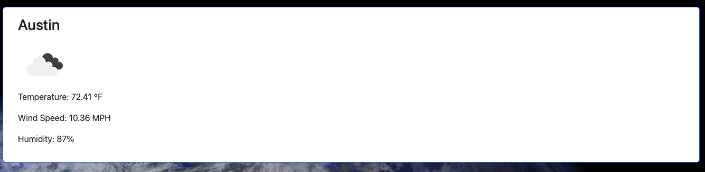
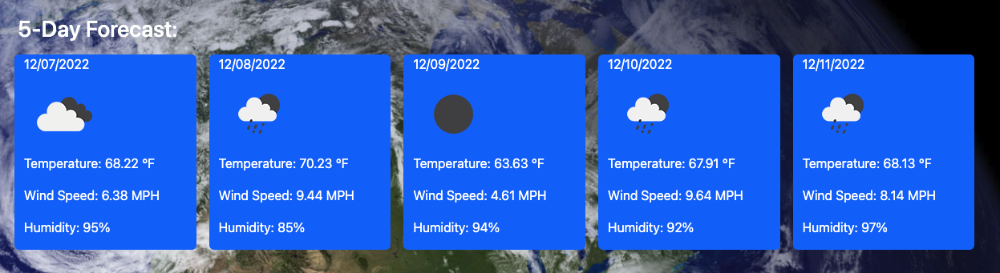
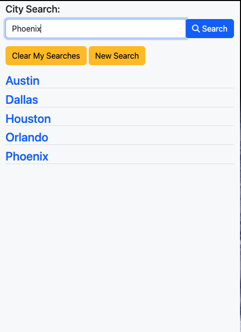

# Weather Dashboard

- **URL**: *https://samocain93.github.io/weather-dashboard/*

## Description

A simple application that utilizes third party API's to retrieve both current weather data and a 5 day forecast for searched cities.

The application functions to take in a search input for a city, render both the current weather info in a display box, as well as a 5 day forecast for the given city containing the same weather data. The page will save the user's searched history into local storage and retrieve it to display the 5 most recent searched cities. Upon rendering the search history to the page, the user will be able to click the previously searched cities and have the information repopulate to the page to view the weather.

## Usage

1. Home Page

    

2. Upon starting the application, the user will be able to enter in a city in the input box.

    

3. After the search is submitted, the page will display the current weather data for the entered city as well as a 5-day forecast below it in a card layout.

    

    

    4. The user's history will be displayed below the search input as shown below, where the user can click a city to render the data again to the page - as well as have options to clear the search history or start a new search entirely. 

    